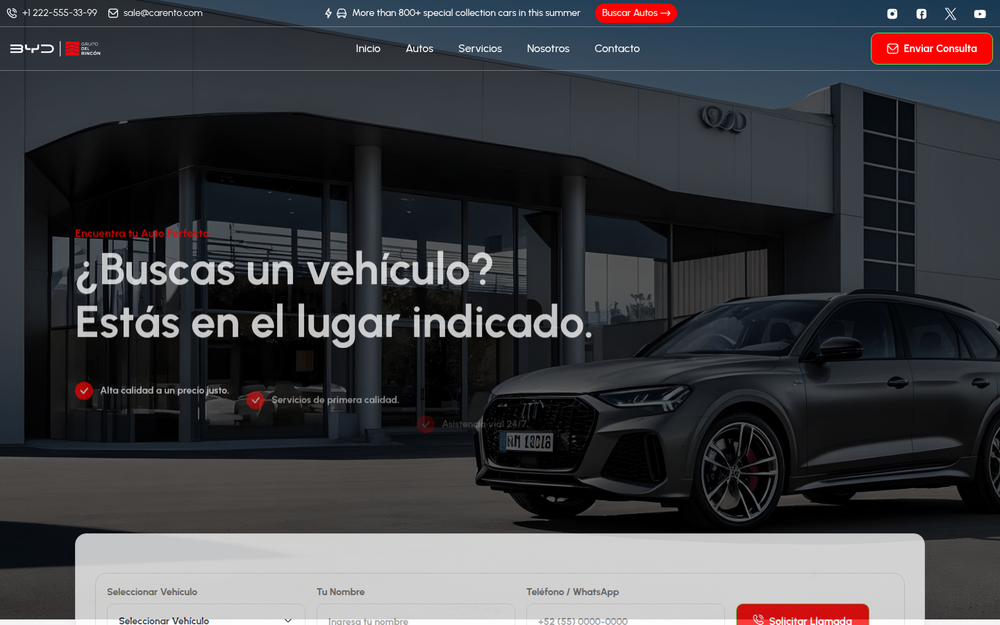
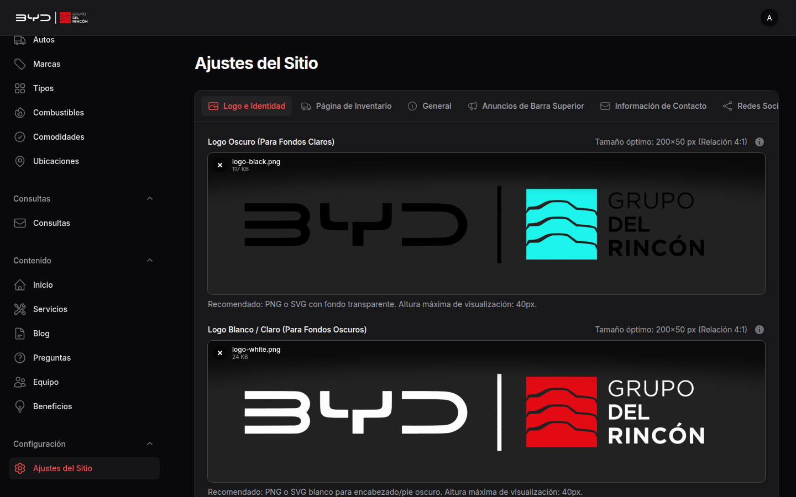

# Guía de Actualización: Logotipo y Marca de la Agencia

Esta guía demuestra cómo gestionar y actualizar los logotipos oficiales y el favicon del sitio web desde el panel de control administrativo.

---

## 1. Dónde se Muestra en el Sitio Web (Frontend)

El logotipo de la agencia se utiliza en tres ubicaciones estratégicas:
1. **Encabezado Superior (Header)**: En la barra de navegación principal visible en todas las páginas.
2. **Pie de Página (Footer)**: Versión en contraste sobre fondo oscuro.
3. **Pestaña del Navegador (Favicon)**: Ícono cuadrado que identifica al sitio en las pestañas del navegador y marcadores.

---

## 2. Dónde se Actualiza en el Panel Administrativo

* **Ruta de Navegación**:
  - En Español: **Configuración** ➔ **Ajustes del Sitio** ➔ Pestaña **"Logo e Identidad"**
  - En Inglés: **Settings** ➔ **Site Settings** ➔ Tab **"Logo & Branding"**
* **Enlace Directo**: 
  - Local: `http://127.0.0.1:8000/admin/manage-settings`
  - Producción: `https://project11.client.winrysoft.com/admin/manage-settings`

---

## 3. Especificaciones Técnicas de los Campos

| Campo en el Administrador | Clave en BD | Formato Recomendado | Dimensiones Óptimas | Ubicación en el Sitio |
| :--- | :--- | :--- | :--- | :--- |
| **Logo Oscuro (Para Fondos Claros)** | `site_logo_dark` | PNG o SVG con fondo transparente | **200 × 50 px** (Relación 4:1) | Encabezado principal (Header) |
| **Logo Blanco / Claro (Para Fondos Oscuros)** | `site_logo_light` | PNG o SVG blanco con fondo transparente | **200 × 50 px** (Relación 4:1) | Pie de página (Footer) y menús oscuros |
| **Ícono Favicon** | `site_favicon` | PNG, ICO o SVG | **64 × 64 px** o **32 × 32 px** (Relación 1:1) | Pestañas del navegador y accesos directos |

---

## 4. Paso a Paso para Cambiar el Logotipo

1. Inicia sesión en el panel administrativo (`/admin`).
2. En el menú lateral izquierdo, haz clic en **Ajustes del Sitio** (dentro del grupo *Configuración*).
3. Asegúrate de estar en la primera pestaña: **Logo e Identidad**.
4. Si ya existe un logotipo anterior, haz clic en el icono **×** para removerlo.
5. Arrastra tu nuevo archivo de imagen o haz clic en el recuadro para seleccionarlo desde tu computadora.
6. Desplázate hacia abajo y haz clic en el botón verde **Guardar Cambios**.
7. Refresca la página pública del sitio web (`Ctrl + F5`) para ver el nuevo logotipo aplicado de inmediato.

---

## 5. Hallazgos de la Auditoría: Puntos Fuertes y Limitaciones

### Puntos Fuertes (Positives)
* **Actualización en Tiempo Real**: Cambiar el logo actualiza automáticamente tanto el frontend público como el logotipo del panel administrativo de Filament.
* **Persistencia Robusta**: Los archivos se almacenan en el disco público (`storage/settings/`) y se vinculan de forma limpia con la base de datos.
* **Vista Previa Inmediata**: El administrador muestra el archivo cargado directamente en la interfaz antes y después de guardar.

### Limitaciones / Áreas a Considerar (Shortcomings)
* **Restricción de Proporción (Altura fija en CSS)**:
  - El encabezado y el pie de página tienen una altura fija para la imagen (`max-height: 40px` o `48px`).
  - **Consecuencia**: Si el cliente sube un logotipo cuadrado (ej. 500×500 px) o vertical, el sistema lo reducirá a 40px de alto, haciendo que se vea diminuto. Debe usarse siempre un logotipo horizontal apaisado (~4:1).
* **Texto Alternativo (`alt`)**:
  - El atributo `alt=""` de la etiqueta `` toma automáticamente el nombre configurado en `site_name` (ej. "BYD Grupo Del Rincón"). No hay un campo específico para definir un texto alternativo SEO personalizado para el logo.
* **Valores por Defecto (Fallbacks)**:
  - Si se borran los logotipos y se deja el campo vacío, el sistema recurre a los archivos SVG predeterminados de la plantilla original (`assets/imgs/template/logo-d.svg`).
