# Manual Completo de Administración: Concesionario de Vehículos

Bienvenido al manual operativo y de administración del sitio web. Esta guía proporciona instrucciones detalladas, paso a paso, con capturas de pantalla reales y especificaciones técnicas para actualizar y gestionar cada elemento visible de la plataforma a través del panel de control administrativo (Filament Admin).

---

## Índice de Contenidos

1. [Acceso y Navegación General](#1-acceso-y-navegación-general)
2. [Identidad de Marca, Logotipos y Colores](#2-identidad-de-marca-logotipos-y-colores)
3. [Barra Superior y Anuncios Rotativos](#3-barra-superior-y-anuncios-rotativos)
4. [Página de Inicio (Home Editor)](#4-página-de-inicio-home-editor)
   - [Visibilidad de Secciones](#41-control-de-visibilidad-de-secciones)
   - [Banner Principal (Hero)](#42-banner-principal-hero)
   - [Banner Promocional CTA con Video](#43-banner-promocional-cta-con-video)
   - [Títulos de Categorías y Novedades](#44-títulos-de-categorías-y-novedades)
5. [Gestión de Marcas y Fabricantes](#5-gestión-de-marcas-y-fabricantes)
6. [Inventario de Vehículos (Autos)](#6-inventario-de-vehículos-autos)
   - [Listado y Filtros de Inventario](#61-listado-y-filtros-de-inventario)
   - [Crear o Editar un Vehículo](#62-crear-o-editar-un-vehículo)
   - [Configuración de la Página Pública de Inventario](#63-configuración-de-la-página-pública-de-inventario)
7. [Beneficios y "¿Por Qué Elegirnos?"](#7-beneficios-y-por-qué-elegirnos)
8. [Servicios de la Agencia](#8-servicios-de-la-agencia)
9. [Equipo de Asesores ("Nosotros")](#9-equipo-de-asesores-nosotros)
10. [Información de Contacto y Pie de Página (Footer)](#10-información-de-contacto-y-pie-de-página-footer)
11. [Bandeja de Clientes Potenciales (Leads / Inquiries)](#11-bandeja-de-clientes-potenciales-leads--inquiries)

---

## 1. Acceso y Navegación General

### 1.1 Enlaces de Acceso
* **Entorno de Producción**: `https://project11.client.winrysoft.com/admin`
* **Entorno Local**: `http://127.0.0.1:8000/admin`
* **Credenciales de Acceso Predeterminadas**:
  - **Usuario / Correo**: `admin@admin.com`
  - **Contraseña**: *(Proporcionada por el administrador de sistemas)*

### 1.2 Organización del Panel Lateral
El panel administrativo organiza sus funciones en tres grupos principales:
1. **Contenido**:
   - *Home Editor*: Modificación de textos y banners de la portada.
   - *Autos*: Catálogo completo de vehículos en venta.
   - *Marcas*: Logotipos de fabricantes automotrices.
   - *Beneficios*: Tarjetas de ventajas competitivas.
   - *Servicios*: Catálogo de servicios de taller y venta.
   - *Equipo*: Fichas de asesores y ejecutivos comerciales.
   - *Blog*: Artículos y noticias del sector.
2. **Clientes**:
   - *Consultas*: Bandeja centralizada de mensajes, solicitudes de cotización y llamadas.
3. **Configuración**:
   - *Ajustes del Sitio*: Marca, contacto, enlaces sociales, colores y pie de página.

---

## 2. Identidad de Marca, Logotipos y Colores

Permite actualizar los logos oficiales, el favicon de la pestaña del navegador y la paleta cromática de la web.

### Ubicación en el Sitio Web
* **Frontend**: Logotipo principal en el encabezado (Header) y logotipo blanco en el pie de página (Footer).

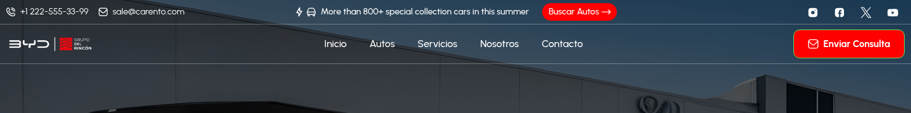

### Dónde se Edita en el Administrador
* **Ruta**: **Configuración** ➔ **Ajustes del Sitio** ➔ Pestaña **"Logo e Identidad"** (en inglés: *Settings ➔ Site Settings ➔ Logo & Branding*).
* **URL**: `/admin/manage-settings`

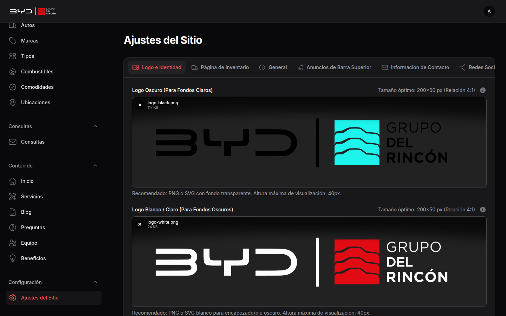

### Campos Disponibles
| Campo | Clave BD | Formato Recomendado | Dimensiones Óptimas | Uso |
| :--- | :--- | :--- | :--- | :--- |
| **Logo Oscuro (Para fondos claros)** | `site_logo_dark` | PNG o SVG transparente | **200 × 50 px** | Barra de navegación superior fija |
| **Logo Blanco (Para fondos oscuros)** | `site_logo_light` | PNG o SVG blanco transparente | **200 × 50 px** | Pie de página oscuro |
| **Favicon** | `site_favicon` | PNG o ICO | **32 × 32 px** o **64 × 64 px** | Pestaña del navegador y marcadores |

> [!TIP]
> Use siempre imágenes horizontales (proporción aproximada 4:1). Si sube un logo vertical o cuadrado, la altura fija de 40px del CSS hará que se vea diminuto.

---

## 3. Barra Superior y Anuncios Rotativos

La barra superior muestra información de contacto rápido y un carrusel dinámico de ofertas o avisos comerciales.

### Dónde se Edita en el Administrador
* **Ruta**: **Configuración** ➔ **Ajustes del Sitio** ➔ Pestaña **"Anuncios de Barra Superior"** y **"General"**.
* **URL**: `/admin/manage-settings`

### Campos y Funcionalidad
1. **Teléfono y Correo Directo**:
   - Ubicado en la pestaña *General* o *Información de Contacto*.
   - Se reflejan instantáneamente en el extremo izquierdo de la barra superior.
2. **Mensajes Rotativos (Ticker)**:
   - En la pestaña *Anuncios de Barra Superior*, puede agregar múltiples avisos con el botón **"Agregar a Anuncios"**.
   - Cada aviso incluye:
     - **Texto del Anuncio**: Ej. *"Más de 800 vehículos certificados con entrega inmediata"*.
     - **Texto del Botón**: Ej. *"Ver Inventario"*.
     - **Enlace del Botón**: Ej. `/cars`.
   - Si existen 2 o más anuncios, rotan automáticamente cada 4 segundos con una transición suave.

---

## 4. Página de Inicio (Home Editor)

El **Home Editor** permite controlar la estructura completa y los contenidos de la página de inicio.

* **Ruta**: **Contenido** ➔ **Home Editor** (en inglés: *Content ➔ Home Editor*).
* **URL**: `/admin/manage-homepage-settings`

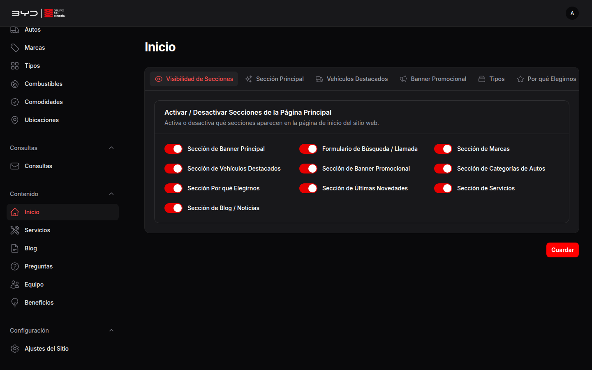

### 4.1 Control de Visibilidad de Secciones
En la pestaña **"Visibilidad de Secciones"** (*Section Visibility*), puede encender o apagar cualquier bloque de la portada mediante interruptores:
- [x] Banner Principal (Hero Section)
- [x] Formulario de Búsqueda / Llamada (Search Form)
- [x] Marcas Destacadas (Brands Showcase)
- [x] Vehículos Destacados (Featured Vehicles)
- [x] Banner Promocional CTA (CTA Promo Banner)
- [x] Categorías por Carrocería (Categories)
- [x] Beneficios "¿Por Qué Elegirnos?" (Why Choose Us)
- [x] Novedades / Recién Llegados (Latest Arrivals)
- [x] Servicios (Services Section)
- [x] Blog y Noticias (Blog Section)

### 4.2 Banner Principal (Hero)
Controla la primera impresión visual de la portada.

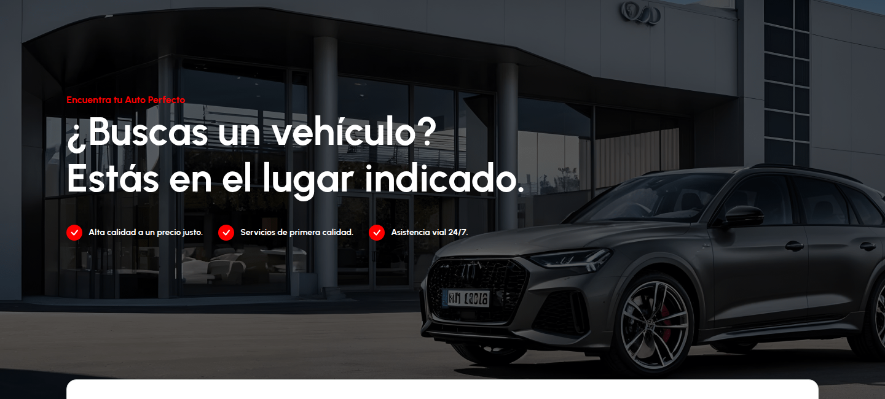

* **Pestaña**: **Hero Section**.
* **Campos**:
  - **Imagen de Fondo**: Imagen de alta definición (Recomendado: **1920 × 892 px** o **3838 × 1784 px** en JPG/WebP). Se aplica automáticamente un filtro oscuro del 60% para garantizar la legibilidad del texto blanco.
  - **Etiqueta Superior (Tagline)**: Texto pequeño de apertura (ej. *"Encuentra tu auto ideal"*).
  - **Título Principal**: Soporta saltos de línea para destacar frases de impacto.
  - **Puntos Destacados (Bullets 1, 2 y 3)**: Las tres ventajas con ícono verde que aparecen bajo el título principal.

### 4.3 Banner Promocional CTA con Video
Sección estratégica para incentivar a los usuarios a vender o tasar su vehículo actual.
* **Pestaña**: **CTA Banner**.
* **Campos**:
  - **Etiqueta (Badge)**: Ej. *"Mejor Concesionario de la Región"*.
  - **Título del Banner**: Encabezado principal del llamado a la acción.
  - **Descripción**: Párrafo explicativo con garantías comerciales.
  - **Enlace de Video (Popup URL)**: Enlace de YouTube (ej. `https://www.youtube.com/watch?v=...`) que se abre en ventana emergente al pulsar reproducir.
  - **Imagen de Portada del Video**: Fotografía en alta resolución representativa del showroom.
  - **Lista de Beneficios (Puntos 1 al 6)**: Características mostradas en dos columnas con viñetas verdes.

### 4.4 Títulos de Categorías y Novedades
Las pestañas **Featured Vehicles**, **Categories**, **Why Choose Us**, **Latest Arrivals**, **Services** y **Blog & News** le permiten personalizar los encabezados y subtítulos de cada uno de esos módulos sin tocar código.

---

## 5. Gestión de Marcas y Fabricantes

Permite gestionar el carrusel continuo de logotipos de marcas presentes en la agencia (BYD, Toyota, Honda, BMW, etc.).

### Frontend
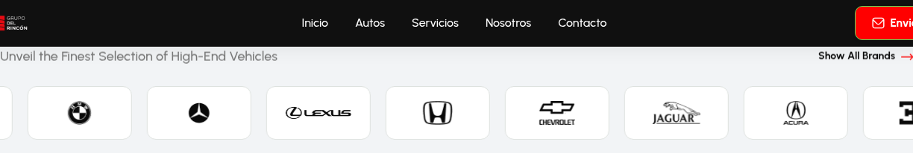

### Dónde se Administra
* **Ruta**: **Contenido** ➔ **Marcas** (en inglés: *Content ➔ Brands*).
* **URL**: `/admin/brands`

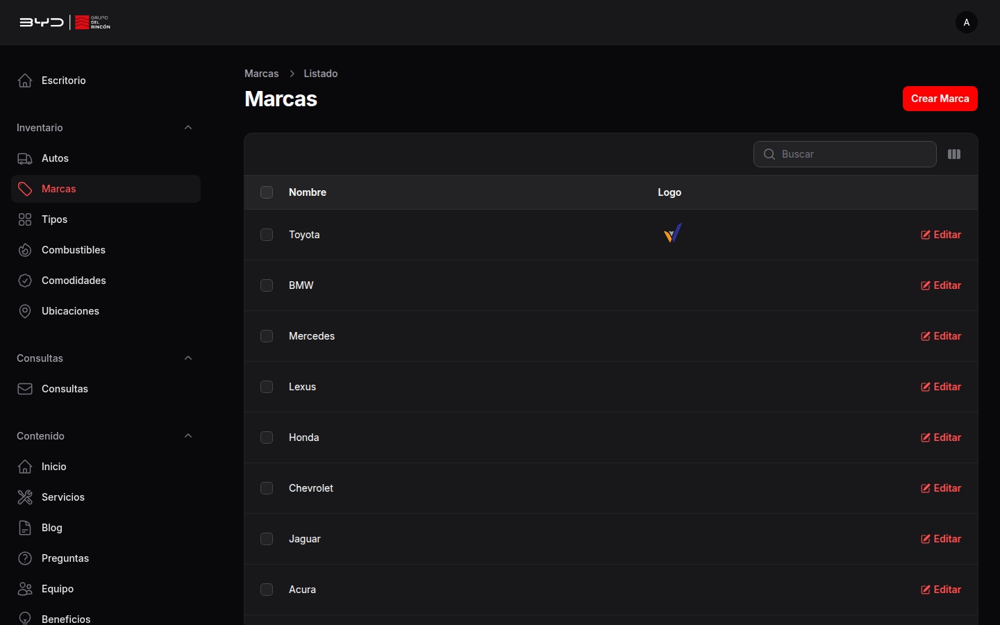

### Cómo Agregar o Editar una Marca
1. Haga clic en el botón superior derecho **Nueva Marca** (*New Brand*).
2. Complete los campos:
   - **Nombre**: Nombre oficial del fabricante (ej. *BYD*, *Nissan*).
   - **Slug**: Se genera automáticamente a partir del nombre.
   - **Logotipo**: Archivo SVG o PNG con fondo transparente (dimensiones óptimas: **120 × 40 px** en color monocromático o neutro).
   - **Activo**: Interruptor para publicar u ocultar la marca en el carrusel.
3. Haga clic en **Crear** (*Create*). Al hacer clic sobre cualquier marca en el carrusel de la portada, el usuario es redirigido automáticamente a la página de inventario filtrada por esa marca.

---

## 6. Inventario de Vehículos (Autos)

Este es el módulo central del concesionario. Permite gestionar todo el ciclo de vida de los vehículos en venta: alta, fotos, precios, kilometraje, fichas técnicas y financiamiento.

### 6.1 Listado y Filtros de Inventario
* **Ruta**: **Contenido** ➔ **Autos** (en inglés: *Content ➔ Cars*).
* **URL**: `/admin/cars`

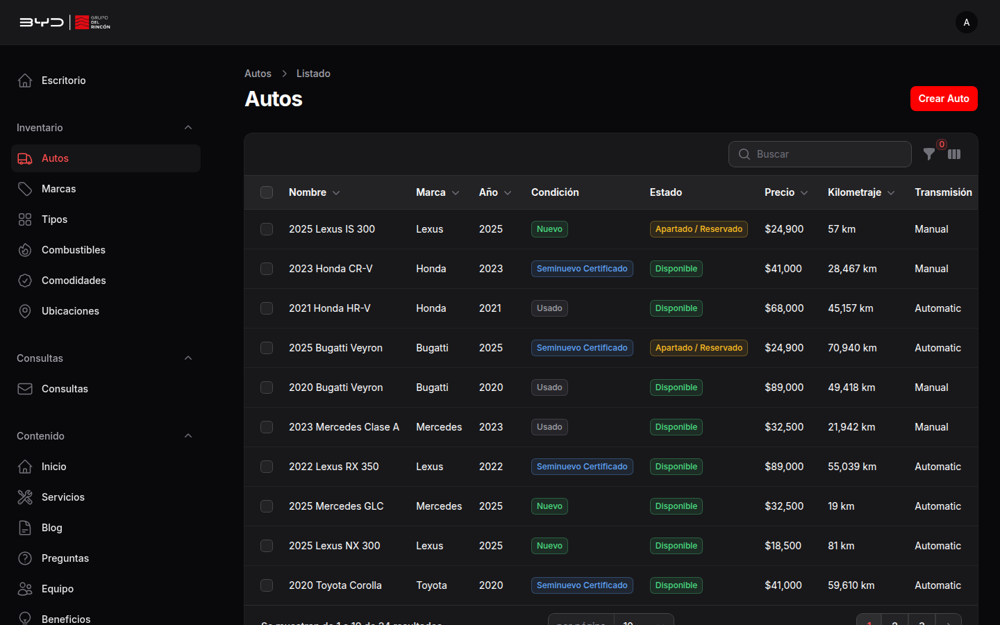

En la tabla puede:
- Visualizar la miniatura principal del auto, marca, modelo, precio, año y condición (Nuevo, Usado, Certificado).
- Alternar directamente con un clic los interruptores **Activo** (*Is Active*) y **Destacado** (*Is Featured*).
- Buscar por nombre, marca o modelo y ordenar por precio o fecha.

### 6.2 Crear o Editar un Vehículo
Haga clic en **Nuevo Auto** o en el botón **Editar** de un vehículo existente.

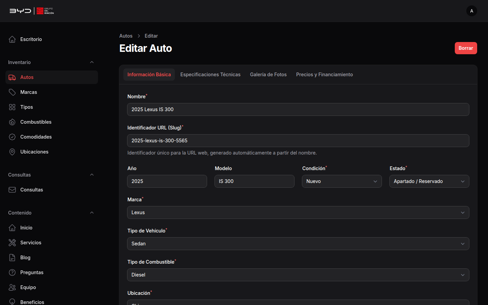

#### Pestañas del Formulario:
1. **Información General**:
   - **Nombre**: Ej. *2025 BYD Seal AWD Performance*.
   - **Marca** y **Tipo de Carrocería**: Selección desplegable vinculada a las tablas maestras.
   - **Condición**: *Nuevo*, *Certificado*, *Usado* o *Reacondicionado*.
   - **Precio**: Valor total en la moneda local configurada.
   - **Cuota Mensual Estimada**: Monto referencial para la insignia de financiamiento (ej. *$4,999/mes*).
   - **Año**, **Kilometraje**, **Transmisión** (Automática, Manual) y **Combustible** (Eléctrico, Híbrido, Gasolina, Diésel).
2. **Galería Multimedia**:
   - **Imagen Principal**: Foto de portada en alta resolución (proporción recomendada **16:9** o **4:3**, ej. **1200 × 800 px**).
   - **Galería de Fotos Adicionales**: Cargador múltiple de imágenes de interiores, motor y detalles. Permite reordenar arrastrando.
3. **Ficha Técnica y Equipamiento**:
   - Cilindrada, potencia (HP), capacidad de pasajeros, número de puertas, color exterior e interior.
   - Casillas de verificación para comodidades y equipamiento (Aire acondicionado, Pantalla táctil, Techo panorámico, Sensores de reversa, etc.).
4. **Opciones de Publicación**:
   - **Activo**: Si está desactivado, no aparecerá en búsquedas ni inventario.
   - **Destacado**: Si está activado, aparecerá en el carrusel de vehículos destacados de la página de inicio.

### 6.3 Configuración de la Página Pública de Inventario
La página pública de catálogo (`/cars`) cuenta con su propio banner personalizable.

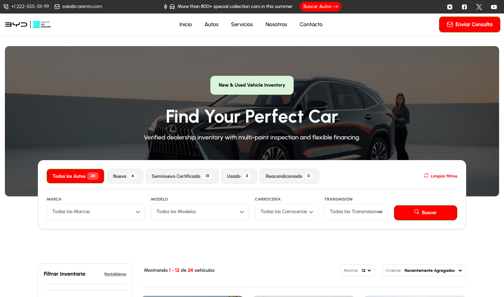

* **Ruta de Edición**: **Configuración** ➔ **Ajustes del Sitio** ➔ Pestaña **"Página de Inventario"** (*Inventory Page*).
* **Campos**:
  - **Imagen de Banner**: Banner panorámico del showroom.
  - **Etiqueta del Banner**: Ej. *"Inventario de Vehículos Nuevos y Seminuevos"*.
  - **Título**: Ej. *"Encuentra el auto que estás buscando"*.
  - **Subtítulo**: Texto descriptivo de garantía y facilidades de compra.

---

## 7. Beneficios y "¿Por Qué Elegirnos?"

Sección de cuatro bloques que expone los argumentos comerciales de confianza del concesionario (Inspección certificada, financiamiento flexible, garantía extendida, etc.).

### Frontend
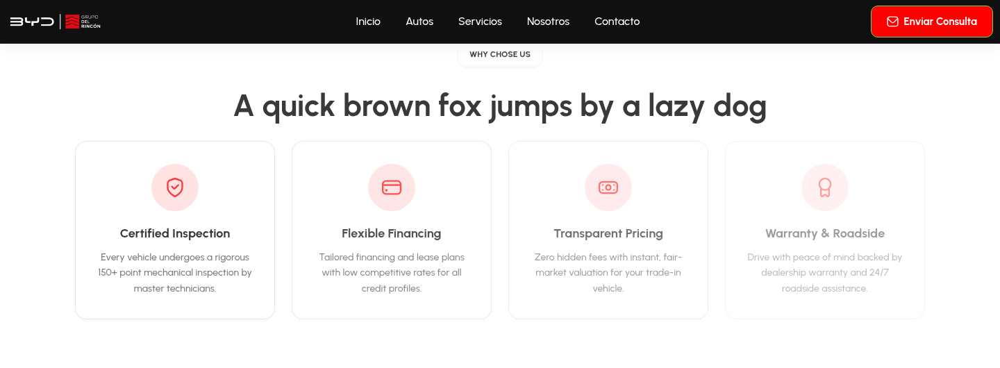

### Dónde se Administra
* **Ruta**: **Contenido** ➔ **Beneficios** (en inglés: *Content ➔ Why Us Features*).
* **URL**: `/admin/why-us-features`

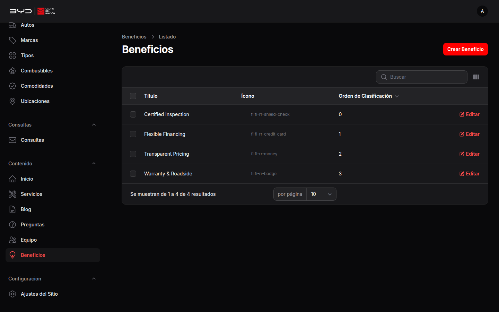

### Campos de Cada Beneficio
- **Título**: Encabezado breve (ej. *Inspección en 150 Puntos*).
- **Descripción**: Explicación clara de 2 a 3 líneas del beneficio para el cliente.
- **Ícono o Número**: Identificador visual o número secuencial (1, 2, 3, 4).
- **Orden**: Número para determinar qué tarjeta aparece primero de izquierda a derecha.

---

## 8. Servicios de la Agencia

Gestiona el catálogo de servicios de taller, postventa, trámites y mantenimiento que se muestran en `/services` y en la sección correspondiente de la página de inicio.

### Frontend
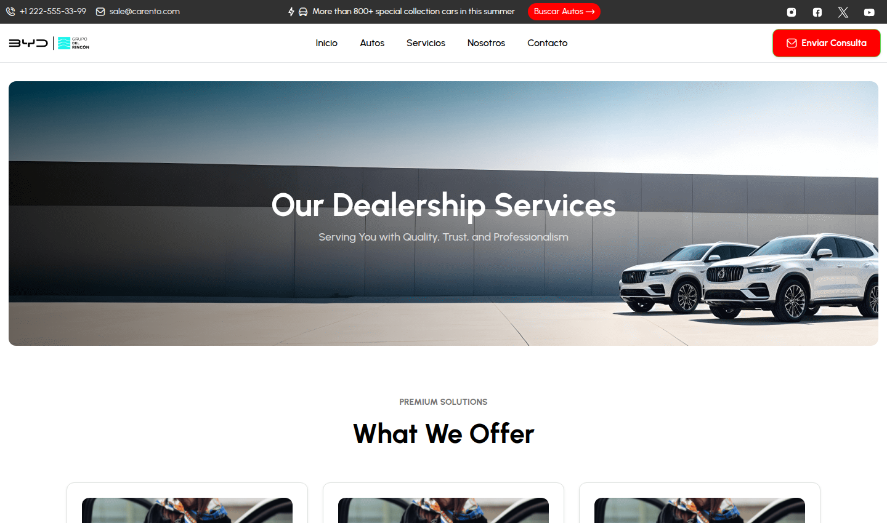

### Dónde se Administra
* **Ruta**: **Contenido** ➔ **Servicios** (en inglés: *Content ➔ Services*).
* **URL**: `/admin/services`

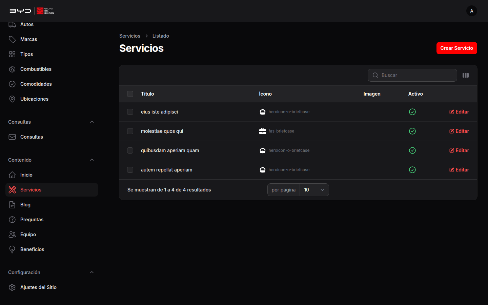

### Campos de Cada Servicio
- **Título del Servicio**: Ej. *Mantenimiento Preventivo y Garantía*.
- **Descripción Detallada**: Alcance de los trabajos realizados por los técnicos certificados.
- **Imagen de Portada**: Fotografía en proporción 4:3 (ej. **800 × 600 px**) ilustrativa del servicio.
- **Ícono**: Identificador de ícono gráfico para la tarjeta.
- **Activo**: Interruptor de publicación.

Cada tarjeta de servicio incluye en el frontend el botón **"Solicitar Información"**, el cual abre la ventana modal de contacto vinculada directamente a la bandeja de prospectos.

---

## 9. Equipo de Asesores ("Nosotros")

Presenta a los ejecutivos de ventas, gerentes y especialistas automotrices en la página institucional `/about`.

### Frontend
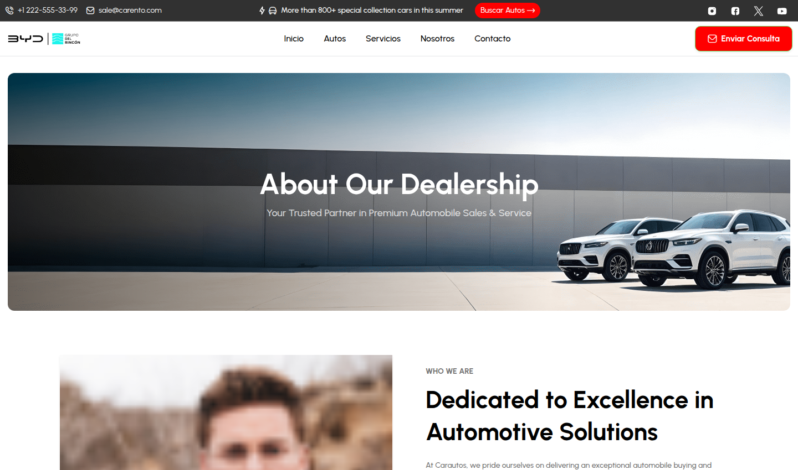

### Dónde se Administra
* **Ruta**: **Contenido** ➔ **Equipo** (en inglés: *Content ➔ Team Members*).
* **URL**: `/admin/team-members`

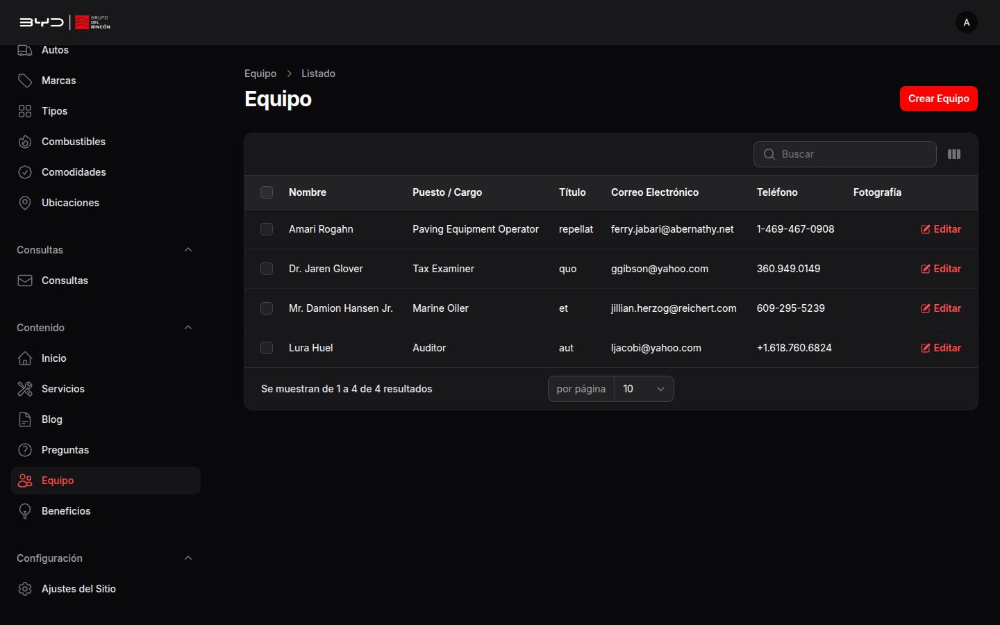

### Campos de Cada Integrante
- **Nombre Completo**: Ej. *Lic. Roberto Gómez*.
- **Cargo / Especialidad**: Ej. *Gerente de Ventas BYD*, *Asesor Financiero Certificado*.
- **Fotografía de Perfil**: Foto profesional vertical (proporción recomendada **3:4**, ej. **600 × 800 px** en JPG).
- **Correo Electrónico** y **Teléfono**: Canales de contacto directo del asesor.
- **Orden de Aparición**: Posición secuencial en la cuadrícula de presentación.

---

## 10. Información de Contacto y Pie de Página (Footer)

Centraliza los canales de atención al cliente, dirección física, horarios comerciales y aviso legal de derechos reservados.

### Frontend
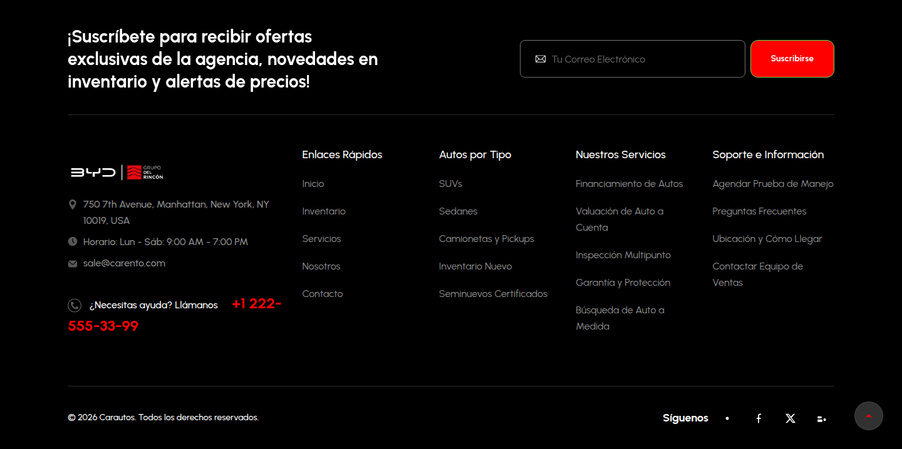

### Dónde se Administra
* **Ruta**: **Configuración** ➔ **Ajustes del Sitio** ➔ Pestañas **"Información de Contacto"**, **"Redes Sociales"** y **"Pie de Página"**.
* **URL**: `/admin/manage-settings`

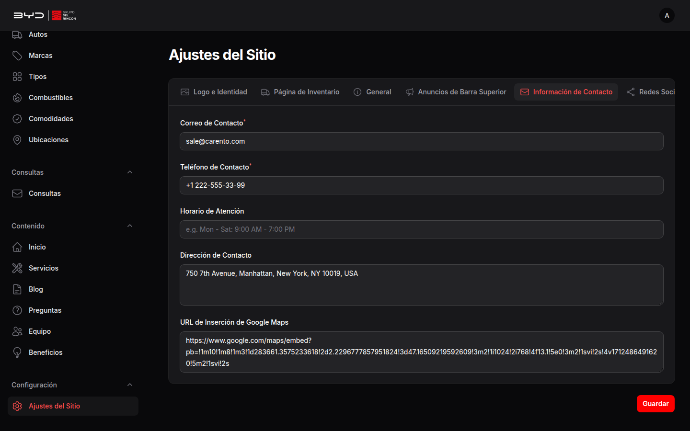

### Campos Clave
| Pestaña | Campo en el Admin | Clave BD | Descripción |
| :--- | :--- | :--- | :--- |
| **Contacto** | **Teléfono** | `contact_phone` | Línea de atención y soporte telefónico con enlace directo `tel:`. |
| **Contacto** | **Correo Electrónico** | `contact_email` | Buzón principal para dudas y cotizaciones con enlace `mailto:`. |
| **Contacto** | **Horario de Atención** | `contact_hours` | Días y horas laborales (ej. *Lun - Sáb: 9:00 AM - 7:00 PM*). |
| **Contacto** | **Dirección Física** | `contact_address` | Ubicación del showroom comercial mostrado en footer y página `/contact`. |
| **Contacto** | **Google Maps Embed URL** | `google_map_embed` | Enlace iframe del mapa interactivo de ubicación. |
| **Redes** | **Facebook / Instagram / X** | `social_*` | Enlaces directos a los perfiles sociales oficiales. |
| **Footer** | **Aviso de Copyright** | `footer_copyright` | Texto legal. Admite variables automáticas `{year}` y `{site_name}`. |

---

## 11. Bandeja de Clientes Potenciales (Leads / Inquiries)

Todos los formularios de contacto del sitio web alimentan una bandeja centralizada de prospectos comerciales para el equipo de ventas:
1. Formulario de prueba de manejo (Test Drive) en la ficha de cada vehículo.
2. Botón flotante y de cabecera **"Enviar Consulta"** (*Lead Modal*).
3. Formulario principal de la página de contacto (`/contact`).
4. Formulario de suscripción a novedades del pie de página.

### Frontend
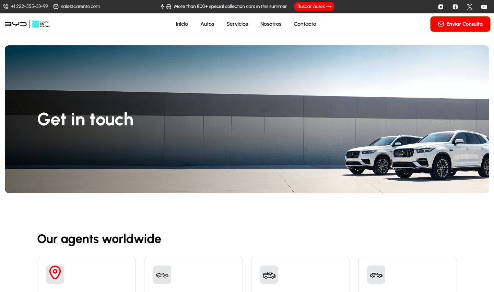

### Dónde se Gestiona en el Administrador
* **Ruta**: **Clientes** ➔ **Consultas** (en inglés: *Inquiries ➔ Inquiries*).
* **URL**: `/admin/inquiries`

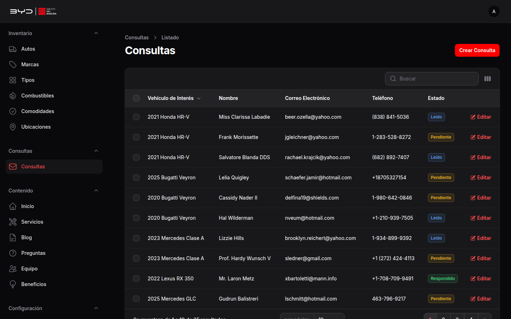

### Datos Registrados en Cada Consulta
- **Nombre del Cliente**: Nombre y apellido del interesado.
- **Teléfono**: Número telefónico obligatorio para seguimiento inmediato por llamada o WhatsApp.
- **Correo Electrónico**: Buzón del prospecto para envío de cotizaciones.
- **Vehículo de Interés**: Enlace al modelo específico si la consulta se originó desde la ficha de un auto.
- **Mensaje**: Comentarios, dudas sobre financiamiento o solicitud de prueba de manejo.
- **Fecha y Hora**: Registro de auditoría cronológico del momento en que se generó el lead.

---

## Resumen de Buenas Prácticas para Administradores

1. **Optimización de Imágenes**:
   - Utilice formatos modernos como **WebP** o **JPG comprimido** para fotografías de vehículos y banners.
   - Para logotipos y marcas, utilice siempre **SVG** o **PNG transparente**.
2. **Dimensiones Homogéneas**:
   - Mantenga siempre la misma proporción en las fotos de los autos (preferiblemente 16:9) para que las tarjetas del inventario se alineen perfectamente.
3. **Limpieza de Caché**:
   - El sistema actualiza automáticamente la caché al hacer clic en **Guardar Cambios**. Si no visualiza un cambio de inmediato en su navegador, presione `Ctrl + F5` para recargar los estilos y archivos locales.
